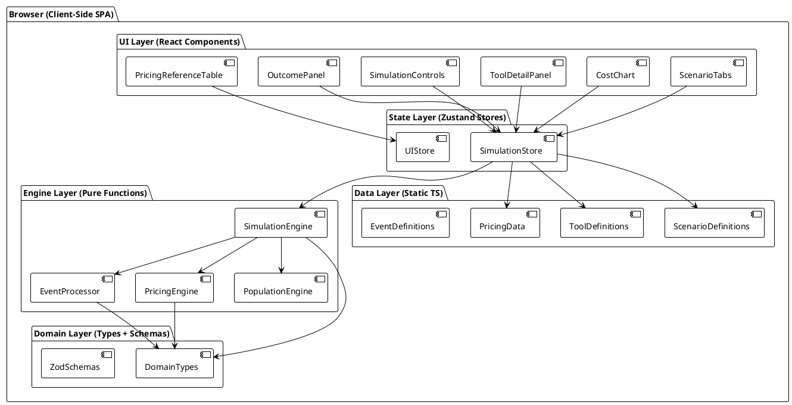
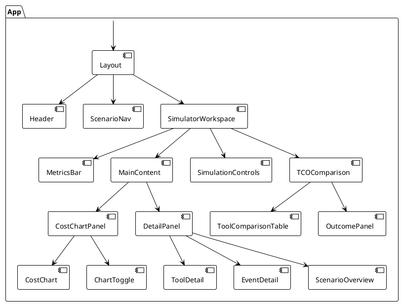
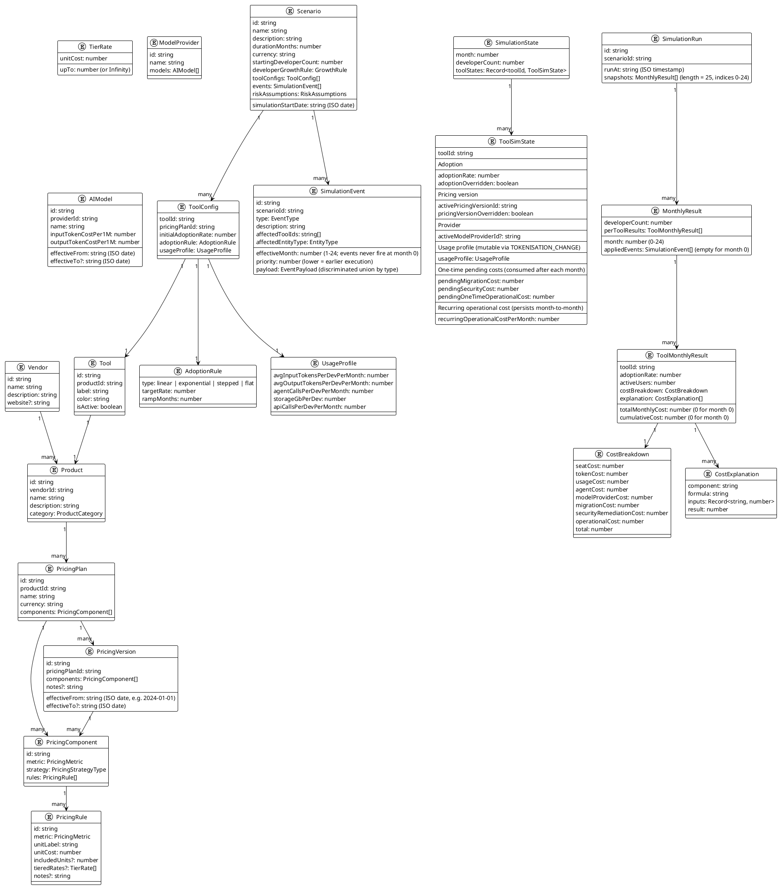
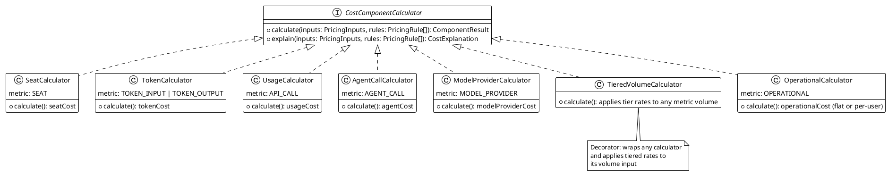

# AI Coding Cost Economics Simulator — Implementation Plan

> **Status:** PENDING USER APPROVAL — Do not implement until approved.

---

## Table of Contents

1. [Executive Summary](#1-executive-summary)
2. [Assumptions](#2-assumptions)
3. [Functional Requirements](#3-functional-requirements)
4. [Non-Functional Requirements](#4-non-functional-requirements)
5. [Architecture](#5-architecture)
6. [Component Architecture](#6-component-architecture)
7. [Domain Model](#7-domain-model)
8. [Simulation Algorithm](#8-simulation-algorithm)
9. [Event-Processing Algorithm](#9-event-processing-algorithm)
10. [Pricing Strategy Architecture](#10-pricing-strategy-architecture)
11. [State Management](#11-state-management)
12. [Data Model](#12-data-model)
13. [UI Architecture](#13-ui-architecture)
14. [File Structure](#14-file-structure)
15. [Future Backend/API Boundary](#15-future-backendapi-boundary)
16. [Testing Strategy](#16-testing-strategy)
17. [Security](#17-security)
18. [Performance](#18-performance)
19. [Accessibility](#19-accessibility)
20. [Deployment](#20-deployment)
21. [Implementation Phases](#21-implementation-phases)
22. [Acceptance Criteria](#22-acceptance-criteria)
23. [Risks and Mitigations](#23-risks-and-mitigations)
24. [Architectural Decisions Requiring User Approval](#24-architectural-decisions-requiring-user-approval)
25. [Changes Made](#25-changes-made)
26. [Remaining Architectural Decisions](#26-remaining-architectural-decisions)

---

## 1. Executive Summary

The AI Coding Cost Economics Simulator is a professional, client-side web application that enables engineering leaders, architects, CTO/CIO teams, and FinOps/procurement teams to compare the true 24-month total cost of ownership (TCO) of AI coding tools.

The core design principle is a **deterministic, event-driven simulation engine** that is completely separated from the UI. Given identical scenario inputs, the engine always produces identical outputs, making simulations auditable, explainable, and reproducible.

The MVP delivers:
- Three predefined scenarios (Modernisation at Scale, The Agentic Shift, Sovereignty First)
- A Pricing Reference tab for tool/vendor comparison at rest
- Five fictional tools (Tool A through Tool E) with distinct pricing models
- A 25-snapshot simulation: Month 0 (baseline) plus Months 1–24 (billing periods), with play/pause/step controls
- Monthly and cumulative chart views with event markers
- Tool deep-dive and cost breakdown panels
- A final 24-month outcome summary with recommendation
- A full automated test suite covering the simulation and pricing engines

The technology stack is TypeScript (strict), React (current stable), Vite (current stable), Zustand, Recharts, Zod, Tailwind CSS v4, shadcn/ui, and Vitest (current stable compatible with Vite). Exact versions are resolved at scaffold time from official documentation — they are not pinned in this plan.

---

## 2. Assumptions

- **No backend for MVP.** All simulation logic, scenario data, and pricing data are bundled client-side. LocalStorage is used for optional state persistence.
- **No authentication.** Any user can access all scenarios.
- **No real vendor prices.** Tools A–E use fictional but structurally realistic pricing data. The architecture supports future substitution with real published prices.
- **Desktop-first responsive layout.** Primary viewport targets ≥1280px but must be usable at 768px.
- **24-month fixed duration for MVP.** Duration is configurable in the domain model but hardcoded per scenario in the MVP.
- **All currencies are USD for MVP.** Multi-currency support is planned in the domain model.
- **Screenshots were not available** — the UI layout described in the product brief is the canonical reference.
- **Technology versions are resolved at scaffold time** from official documentation. This plan does not pin specific patch versions.
- **Tailwind CSS v4 does not require `tailwind.config.ts`** — configuration lives in CSS. This file is omitted from the project.
- **No IE/legacy browser support.** Modern Chromium/Firefox/Safari only.

---

## 3. Functional Requirements

### FR-01: Scenario Navigation
- FR-01-1: Four tabs are always visible: Modernisation at Scale, The Agentic Shift, Sovereignty First, Pricing Reference.
- FR-01-2: Switching tabs resets the active simulation to Month 0 (baseline) of that scenario.
- FR-01-3: Each scenario tab shows a scenario overview, decision points, and economic events list.

### FR-02: Simulation Controls
- FR-02-1: Play/Pause button advances the simulation one month per tick (configurable interval, default 800ms).
- FR-02-2: Next Event button advances the simulation to the next month (≥ currentMonth + 1) that contains an event.
- FR-02-3: Previous Event button rewinds the simulation to the nearest month (< currentMonth) that contains an event, or to Month 0 if none.
- FR-02-4: Reset button returns the simulation to Month 0 (baseline snapshot).
- FR-02-5: The current month (0–24) is always visible as a primary metric. Month 0 is labelled "Baseline".

### FR-03: Cost Chart
- FR-03-1: A line/area chart displays all 25 snapshots: Month 0 through Month 24.
- FR-03-2: Each tool renders as a distinct series.
- FR-03-3: A monthly / cumulative toggle switches the chart view. In monthly view, Month 0 shows $0 cost (baseline period, no billing). In cumulative view, Month 0 is the $0 starting point.
- FR-03-4: Event markers appear as vertical reference lines at event months (Months 1–24 only; no events fire at Month 0).
- FR-03-5: A current-month marker highlights the active snapshot.
- FR-03-6: Hovering a data point shows a tooltip with per-tool monthly cost breakdown.
- FR-03-7: Individual tools can be toggled on/off via a legend or tool selector.

### FR-04: Tool & Event Detail Panel
- FR-04-1: Selecting a tool shows its pricing model, current monthly cost, and cost components.
- FR-04-2: Selecting an event shows its description, affected entities, and economic impact.
- FR-04-3: The detail panel updates in real time as the simulation advances.

### FR-05: Key Metrics Bar
- FR-05-1: Current month (0–24) is shown.
- FR-05-2: Cheapest tool at the current month is highlighted.
- FR-05-3: Total cumulative cost for each tool is shown at Month 24.

### FR-06: 24-Month Outcome Panel
- FR-06-1: Visible when simulation reaches Month 24 or via an "Outcomes" section.
- FR-06-2: Shows total cost by tool, cumulative chart, cost predictability rating, cost drivers, event impact summary, security/remediation impact, migration impact, and an explainable interpretation.

### FR-07: Pricing Reference Tab
- FR-07-1: Displays a static comparison table of all tools and their pricing plans.
- FR-07-2: Shows pricing metrics (seat, token, usage), effective dates, and plan versions.

### FR-08: Simulation Engine
- FR-08-1: The primary engine API is `runSimulation(config: ScenarioConfig): SimulationRun`.
- FR-08-2: The incremental API is `simulateMonth(state: SimulationState, config: ScenarioConfig, month: number): SimulationStep`.
- FR-08-3: `SimulationRun.snapshots` contains exactly 25 `MonthlyResult` entries: indices 0–24.
- FR-08-4: Month 0 is the baseline snapshot. It records initial developer count and adoption rates; all tool monthly costs are $0 (no billing period has elapsed). Cumulative costs start at $0.
- FR-08-5: Months 1–24 are billing periods. Each produces a `MonthlyResult` with full cost breakdown and cumulative accumulation.
- FR-08-6: Events are sorted by `effectiveMonth ASC`, then `priority ASC` within the same month. Lower-priority events execute first; higher-priority events execute last and therefore win when they affect the same state.
- FR-08-7: Every `MonthlyResult` contains a fully itemised `CostBreakdown` for each tool.
- FR-08-8: The engine is synchronous (no async I/O) and produces no side effects.

### FR-09: Custom Scenario Support (domain model only, UI optional in MVP)
- FR-09-1: The domain model must support all fields specified in the product brief.
- FR-09-2: Scenario validation uses Zod schemas.

---

## 4. Non-Functional Requirements

- **NFR-01 Determinism:** Running the simulation with the same `ScenarioConfig` always produces identical `snapshots` arrays.
- **NFR-02 Explainability:** Every cost figure must be traceable to a specific `PricingRule`, event, and developer population calculation.
- **NFR-03 TypeScript Strict Mode:** `"strict": true` and `"noImplicitAny": true` throughout.
- **NFR-04 No UI Business Logic:** React components may only read pre-computed results from the state store. Calculations must not occur inside components.
- **NFR-05 Performance:** Full 25-snapshot simulation for one scenario must complete in < 50ms. Chart rendering at 25 data points × 5 tools must be smooth.
- **NFR-06 Accessibility:** WCAG 2.1 AA. Keyboard navigation for all controls. Chart data exposed via accessible table fallback.
- **NFR-07 Testability:** All pure functions in the engine and domain layers must be 100% unit-testable without DOM.
- **NFR-08 Reproducibility:** Simulation runs are serialisable as JSON and can be replayed deterministically.
- **NFR-09 Extensibility:** Adding a new tool, pricing model, or event type must not require modifying existing engine code (open/closed principle).
- **NFR-10 Maintainability:** No duplicated pricing formulas. Single source of truth for each calculation.

---

## 5. Architecture

### High-Level Architecture



### Key Architectural Separations

| Layer | Responsibility | May Import From |
|---|---|---|
| UI (React) | Render pre-computed data, dispatch user actions | State layer only |
| State (Zustand) | Hold simulation results, trigger engine runs, manage playback | Engine layer, Data layer |
| Engine (pure TS) | Calculate monthly results, apply events, compute prices | Domain layer only |
| Domain (types/Zod) | Type definitions, schema validation | Nothing |
| Data (static) | Scenario configs, tool definitions, pricing versions | Domain layer only |

---

## 6. Component Architecture



### Component Responsibilities

| Component | Purpose |
|---|---|
| `Header` | App title, branding |
| `ScenarioNav` | Four scenario tabs |
| `MetricsBar` | Current month (0–24), cheapest tool, key cost figures |
| `CostChart` | Recharts area/line chart with event markers; 25 data points per series |
| `ChartToggle` | Monthly/Cumulative toggle |
| `DetailPanel` | Switchable panel: tool detail or event detail |
| `ToolDetail` | Selected tool pricing breakdown at current month |
| `EventDetail` | Selected event description and economic impact |
| `ScenarioOverview` | Scenario description, decision points list |
| `SimulationControls` | Play/Pause, Next Event, Previous Event, Reset |
| `ToolComparisonTable` | Side-by-side TCO at Month 24 |
| `OutcomePanel` | Full 24-month outcome summary and recommendation |
| `PricingReferenceTable` | Static pricing comparison (Pricing Reference tab only) |

---

## 7. Domain Model



### Key Design Decisions in the Domain Model

- **PricingVersion uses ISO calendar dates** (`effectiveFrom: string`, `effectiveTo?: string`). The simulation engine maps calendar dates to simulation months using `Scenario.simulationStartDate`. This correctly models historical and future real vendor pricing while keeping the engine deterministic. MVP fictional data uses ISO dates that are offset from a fixed simulation start date.
- **PricingPlan has no single `billingModel` enum.** Instead it has a `components: PricingComponent[]` array. Each component has its own `strategy` and `rules`. This allows any combination of cost components (seat + token + agent + usage + operational) without a single strategy type that must handle every possible combination.
- **SimulationState is explicit and fully typed.** `ToolSimState` records every piece of mutable per-tool state: adoption rate, pricing version, model provider, usage profile, pending one-time costs, and recurring operational cost. No state is computed implicitly; events transition state explicitly.
- **Adoption precedence:** `ToolSimState.adoptionOverridden` tracks whether an `ADOPTION_CHANGE` event has set `adoptionRate` for this tool. When `adoptionOverridden === false`, the engine computes adoption from `AdoptionRule`; when `true`, the stored `adoptionRate` is used as-is. The flag persists until another adoption event changes it.
- **Pricing version precedence:** `ToolSimState.pricingVersionOverridden` tracks whether an explicit pricing event has set `activePricingVersionId`. When `false`, the engine resolves the calendar-date-effective version each month. When `true`, the stored version is used. A later explicit pricing event may replace it; a calendar version can supersede an override only if represented as an explicit event, not through hidden calendar resolution.
- **Usage profile:** `ToolSimState.usageProfile` is initialised from `ToolConfig.usageProfile` at Month 0. A `TOKENISATION_CHANGE` event replaces it with a new `UsageProfile`. `ToolConfig.usageProfile` is never mutated. The engine always reads `usageProfile` from `ToolSimState`.
- **One-time costs consume-once:** `pendingMigrationCost`, `pendingSecurityCost`, and `pendingOneTimeOperationalCost` are added to the current month's `CostBreakdown`, then reset to `0` in the `nextState` returned by `simulateMonth`. They can never become recurring.
- **Recurring operational cost:** `recurringOperationalCostPerMonth` is set by `OPERATIONAL_COST_CHANGE` events that represent ongoing charges. It persists across months until another event changes it. It is added to `CostBreakdown.operationalCost` every billing month.
- **Events never fire at Month 0.** `SimulationEvent.effectiveMonth` must be in range 1–24. Month 0 is a pure baseline snapshot.
- **CostBreakdown lists all eight cost components.** Inapplicable components are `0`. This ensures every tool produces the same structure regardless of billing model, making comparison trivial.
- **CostExplanation** is a human-readable audit trail per cost component, enabling "Why did Tool X cost $Y in Month Z?" to be answered from the stored result alone.
- **ToolConfig belongs to a Scenario.** The same Tool can appear in multiple scenarios with different adoption and usage assumptions.
- **SimulationRun.snapshots** has a fixed length of 25 (indices 0–24). Tests must assert this invariant.

---

## 8. Simulation Algorithm

```plantuml
@startuml simulation-algorithm
!theme plain
start

:Load ScenarioConfig|

:Build Month 0 baseline SimulationState
- developerCount = startingDeveloperCount
- each ToolSimState:
    adoptionRate = initialAdoptionRate
    adoptionOverridden = false
    activePricingVersionId = resolveCalendarVersion(plan, simulationStartDate)
    pricingVersionOverridden = false
    usageProfile = toolConfig.usageProfile (copy; never mutate ToolConfig)
    pendingMigrationCost = 0
    pendingSecurityCost = 0
    pendingOneTimeOperationalCost = 0
    recurringOperationalCostPerMonth = 0|

:Emit Month 0 MonthlyResult
- all tool monthly costs = 0
- all cumulative costs = 0
- appliedEvents = empty|

:Sort all scenario events:
  effectiveMonth ASC, then priority ASC|

:month = 1|

repeat

  :Apply DeveloperGrowthRule
  developerCount for this month|

  :Get events where effectiveMonth == month
  already sorted by priority ASC|

  :Apply events in order (lower priority first)
  Returns new immutable SimulationState
  Higher priority events overwrite earlier state changes|

  :For each Tool (in consistent order):

    PRICING VERSION:
    if pricingVersionOverridden == false:
      activePricingVersionId = resolveCalendarVersion(plan, calendarDate)
    else:
      use stored activePricingVersionId

    ADOPTION:
    if adoptionOverridden == false:
      effectiveAdoptionRate = computeAdoption(adoptionRule, month)
    else:
      effectiveAdoptionRate = toolState.adoptionRate

    activeUsers = developerCount * effectiveAdoptionRate

    PRICING:
    inputs = buildPricingInputs(toolState.usageProfile, activeUsers, month)
    pendingCosts = {
      migrationCost: toolState.pendingMigrationCost,
      securityRemediationCost: toolState.pendingSecurityCost,
      operationalCost: toolState.pendingOneTimeOperationalCost
                       + toolState.recurringOperationalCostPerMonth
    }
    breakdown = PricingEngine.calculate(components, inputs, pendingCosts)
    explanation = buildExplanation(breakdown)
    cumulativeCost = prevCumulativeCost + breakdown.total|

  :Emit MonthlyResult for month
  Store developerCount, perToolResults, appliedEvents|

  :Consume one-time costs — produce nextState:
    for each toolState:
      pendingMigrationCost = 0
      pendingSecurityCost = 0
      pendingOneTimeOperationalCost = 0
      (recurringOperationalCostPerMonth unchanged)|

  :month = month + 1|

repeat while (month <= 24)

:Return SimulationRun
snapshots[0..24], length = 25|

stop
@enduml
```

### Simulation Engine Interface

```typescript
// Primary API — pure function, no side effects
function runSimulation(config: ScenarioConfig): SimulationRun

// Incremental API — used internally by runSimulation and optionally for debugging
function simulateMonth(
  state: SimulationState,
  config: ScenarioConfig,
  month: number
): SimulationStep

interface SimulationStep {
  result: MonthlyResult
  nextState: SimulationState
}
```

`runSimulation` is implemented by:
1. Building the Month 0 baseline `SimulationState` (all `adoptionOverridden` and `pricingVersionOverridden` = `false`; all `usageProfile` copied from `ToolConfig`; all pending costs = 0).
2. Emitting the Month 0 `MonthlyResult` (all costs zero).
3. Calling `simulateMonth` for months 1 through 24 in sequence, threading `nextState` forward.
4. Returning a `SimulationRun` with `snapshots` of length 25.

`simulateMonth` is a pure function — it takes a state and returns a new state. It never mutates its inputs. After calculating costs for a month, `simulateMonth` produces `nextState` with all one-time pending costs (`pendingMigrationCost`, `pendingSecurityCost`, `pendingOneTimeOperationalCost`) reset to `0`. `recurringOperationalCostPerMonth` is carried forward unchanged.

### Pricing Version Resolution

```typescript
function resolveCalendarVersion(
  plan: PricingPlan,
  calendarDate: string   // ISO date derived from simulationStartDate + simulationMonth
): PricingVersion
```

This finds the `PricingVersion` where `effectiveFrom <= calendarDate` and either `effectiveTo` is absent or `calendarDate < effectiveTo`.

**Resolution rule with event overrides:**
- If `toolState.pricingVersionOverridden === false`: call `resolveCalendarVersion` to find the current effective version. Store the result in `activePricingVersionId`.
- If `toolState.pricingVersionOverridden === true`: use the stored `activePricingVersionId` without re-resolving. A later `VENDOR_PRICE_CHANGE`, `PRICING_VERSION_CHANGE`, `BILLING_MODEL_CHANGE`, or `AGENT_PRICING_CHANGE` event is the only mechanism to replace it. Hidden calendar supersession does not occur.

### Adoption Resolution Rule

For each tool in each billing month:

- If `toolState.adoptionOverridden === false`: `effectiveAdoptionRate = computeAdoption(toolConfig.adoptionRule, month)`. This provides the normal baseline trajectory.
- If `toolState.adoptionOverridden === true`: `effectiveAdoptionRate = toolState.adoptionRate`. The event-set value persists until another `ADOPTION_CHANGE` event fires.

`computeAdoption` is never called when `adoptionOverridden === true`, ensuring the adoption rule cannot silently overwrite an event-driven change.

---

## 9. Event-Processing Algorithm

```plantuml
@startuml event-processing
!theme plain

start

:Receive sorted events for month M
(sorted effectiveMonth ASC, priority ASC)|

note right
  Events with lower priority numbers
  execute first. Higher priority events
  execute last and WIN on conflicts.
end note

:currentState = incoming SimulationState|

:For each event E in sorted order:
  switch (E.type)

  case VENDOR_PRICE_CHANGE / PRICING_VERSION_CHANGE / BILLING_MODEL_CHANGE / AGENT_PRICING_CHANGE
    :toolState.activePricingVersionId = E.payload.newVersionId
    toolState.pricingVersionOverridden = true|

  case HEADCOUNT_CHANGE
    :developerCount = applyHeadcountChange(current, E.payload)|

  case ADOPTION_CHANGE
    :toolState.adoptionRate = E.payload.newRate
    toolState.adoptionOverridden = true|

  case MIGRATION_EVENT
    :toolState.pendingMigrationCost += E.payload.cost
    (consumed at end of this month; never recurs)|

  case SECURITY_REMEDIATION
    :toolState.pendingSecurityCost += E.payload.cost
    (consumed at end of this month; never recurs)|

  case PROVIDER_MODEL_CHANGE
    :toolState.activeModelProviderId = E.payload.modelId|

  case TOKENISATION_CHANGE
    :toolState.usageProfile = E.payload.newUsageProfile
    (replaces the current usage profile; persists until next TOKENISATION_CHANGE)|

  case OPERATIONAL_COST_CHANGE where E.payload.recurring == true
    :toolState.recurringOperationalCostPerMonth = E.payload.costPerMonth
    (persists month-to-month until another OPERATIONAL_COST_CHANGE replaces it)|

  case OPERATIONAL_COST_CHANGE where E.payload.recurring == false
    :toolState.pendingOneTimeOperationalCost += E.payload.cost
    (consumed at end of this month; never recurs)|

  endswitch
  :Record E in appliedEvents for this month|

:Return new immutable SimulationState|

stop
@enduml
```

### Event Type Enum

```typescript
enum EventType {
  PRICING_VERSION_CHANGE  = 'PRICING_VERSION_CHANGE',
  VENDOR_PRICE_CHANGE     = 'VENDOR_PRICE_CHANGE',
  HEADCOUNT_CHANGE        = 'HEADCOUNT_CHANGE',
  ADOPTION_CHANGE         = 'ADOPTION_CHANGE',
  MIGRATION_EVENT         = 'MIGRATION_EVENT',
  SECURITY_REMEDIATION    = 'SECURITY_REMEDIATION',
  PROVIDER_MODEL_CHANGE   = 'PROVIDER_MODEL_CHANGE',
  BILLING_MODEL_CHANGE    = 'BILLING_MODEL_CHANGE',
  AGENT_PRICING_CHANGE    = 'AGENT_PRICING_CHANGE',
  TOKENISATION_CHANGE     = 'TOKENISATION_CHANGE',
}
```

### Event Ordering Rule

Events are sorted globally before the simulation loop begins:

1. **Primary sort: `effectiveMonth` ASC** — earlier months are processed first.
2. **Secondary sort: `priority` ASC** — within the same month, lower priority number executes first.

**Higher-priority events win** because they execute last and overwrite any state changes made by lower-priority events affecting the same field. This is equivalent to: priority = "who gets the final say."

Example: if a `HEADCOUNT_CHANGE` (priority 10) and an `ADOPTION_CHANGE` (priority 20) both fire at Month 6 and both touch adoption rate, the `ADOPTION_CHANGE` at priority 20 executes last and its value prevails.

### Event Payload Discriminated Union

Each `EventType` has a dedicated payload shape. Key payload fields:

| EventType | Key Payload Fields |
|---|---|
| `VENDOR_PRICE_CHANGE` / `PRICING_VERSION_CHANGE` / `BILLING_MODEL_CHANGE` / `AGENT_PRICING_CHANGE` | `newVersionId: string` |
| `HEADCOUNT_CHANGE` | `mode: 'absolute' \| 'delta'`, `value: number` |
| `ADOPTION_CHANGE` | `newRate: number` (absolute, 0–1) |
| `MIGRATION_EVENT` | `cost: number` (one-time) |
| `SECURITY_REMEDIATION` | `cost: number` (one-time) |
| `PROVIDER_MODEL_CHANGE` | `modelId: string` |
| `TOKENISATION_CHANGE` | `newUsageProfile: UsageProfile` |
| `OPERATIONAL_COST_CHANGE` | `recurring: boolean`, `cost?: number` (one-time), `costPerMonth?: number` (recurring) |

### One-Time vs Recurring Cost Semantics

| Field in ToolSimState | Consumption | Set by |
|---|---|---|
| `pendingMigrationCost` | Charged once; reset to 0 in `nextState` | `MIGRATION_EVENT` |
| `pendingSecurityCost` | Charged once; reset to 0 in `nextState` | `SECURITY_REMEDIATION` |
| `pendingOneTimeOperationalCost` | Charged once; reset to 0 in `nextState` | `OPERATIONAL_COST_CHANGE` with `recurring: false` |
| `recurringOperationalCostPerMonth` | Charged every billing month; persists until replaced | `OPERATIONAL_COST_CHANGE` with `recurring: true` |

A one-time cost **must never appear in more than one snapshot's `CostBreakdown`**. This is enforced by `simulateMonth` resetting the pending fields in the returned `nextState`.

### Immutable State Transitions

`applyEvents` never mutates the input `SimulationState`. It produces a new state object using structural spreading:

```typescript
function applyEvents(
  state: SimulationState,
  events: SimulationEvent[]
): SimulationState
```

Each event handler returns a new `SimulationState`. Handlers are composed in sequence.

---

## 10. Pricing Strategy Architecture

A tool's monthly cost is the **sum of independent cost components**. Each `PricingComponent` in a `PricingPlan` maps to one cost slot in `CostBreakdown`. Multiple components can contribute to the same slot (they accumulate additively).



### PricingEngine

```typescript
// Registry maps PricingMetric to a CostComponentCalculator
const calculatorRegistry: Record<PricingMetric, CostComponentCalculator>

function calculateCost(
  components: PricingComponent[],
  inputs: PricingInputs,
  pendingCosts: PendingCosts
): { breakdown: CostBreakdown; explanation: CostExplanation[] }
```

The function iterates over each `PricingComponent`, invokes its registered calculator, and accumulates results into `CostBreakdown`. `pendingCosts` are merged in at the end as the final step — they are always passed from `ToolSimState` and are never recalculated by the pricing engine.

### Inputs to Pricing Calculation

`PricingInputs` is built from `ToolSimState.usageProfile` (not from `ToolConfig` directly) and the resolved user count:

```typescript
interface PricingInputs {
  activeUsers: number
  // Sourced from ToolSimState.usageProfile (which may have been modified by TOKENISATION_CHANGE):
  monthlyInputTokensPerUser: number
  monthlyOutputTokensPerUser: number
  agentCallsPerUser: number
  apiCallsPerUser: number
  storageGbPerUser: number
  simulationMonth: number       // for time-based tier resolution
  calendarDate: string          // ISO date, derived from simulationStartDate + simulationMonth
}

// Passed from ToolSimState fields; consumed after each month by simulateMonth:
interface PendingCosts {
  migrationCost: number                  // from ToolSimState.pendingMigrationCost
  securityRemediationCost: number        // from ToolSimState.pendingSecurityCost
  operationalCost: number                // pendingOneTimeOperationalCost + recurringOperationalCostPerMonth
}
```

---

## 11. State Management

### Stores

#### SimulationStore (Zustand)

The primary store. Holds the pre-computed simulation run and playback cursor.

```typescript
interface SimulationStore {
  // Data
  activeScenarioId: string
  simulationRun: SimulationRun | null   // snapshots[0..24], length 25
  currentMonth: number                   // 0–24; 0 = baseline

  // Playback
  isPlaying: boolean
  playbackIntervalMs: number

  // Actions
  loadScenario(scenarioId: string): void  // triggers full runSimulation
  advance(): void                          // currentMonth++ (clamp at 24)
  retreat(): void                          // currentMonth-- (clamp at 0)
  nextEvent(): void                        // jump to next month with events
  prevEvent(): void                        // jump to prev month with events (or 0)
  reset(): void                            // currentMonth = 0
  play(): void
  pause(): void
}
```

**Note on `nextEvent` / `prevEvent`:** These operate on `simulationRun.snapshots` to find months where `appliedEvents.length > 0`. Month 0 always has empty `appliedEvents`, so `nextEvent` from Month 0 jumps to the first event month.

#### UIStore (Zustand)

Manages view-only state.

```typescript
interface UIStore {
  selectedToolId: string | null
  selectedEventId: string | null
  chartMode: 'monthly' | 'cumulative'
  visibleToolIds: string[]
  activeDetailPanel: 'tool' | 'event' | 'overview'

  selectTool(toolId: string): void
  selectEvent(eventId: string): void
  setChartMode(mode: 'monthly' | 'cumulative'): void
  toggleToolVisibility(toolId: string): void
}
```

### Data Flow

```
User Action
  → SimulationStore / UIStore action
  → SimulationEngine.runSimulation(config)   [synchronous, < 50ms, returns 25 snapshots]
  → SimulationStore.simulationRun updated
  → React components re-render from store selectors
```

---

## 12. Data Model

All scenario, tool, and pricing data are authored in TypeScript files under `src/data/`. They are validated at startup via Zod schemas.

### Predefined Scenarios

| ID | Name | Description |
|---|---|---|
| `modernisation` | Modernisation at Scale | Large enterprise migrating legacy systems; cost predictability is paramount |
| `agentic-shift` | The Agentic Shift | Organisation adopts autonomous AI agents; token/agent costs dominate |
| `sovereignty-first` | Sovereignty First | Regulated org prioritises data residency; on-premise or sovereign cloud models |
| `pricing-reference` | Pricing Reference | Static tab — no active simulation |

### Tool Definitions (MVP)

| ID | Label | Primary Cost Components | Primary Cost Driver |
|---|---|---|---|
| `tool-a` | Tool A | Seat | Per-developer monthly seat |
| `tool-b` | Tool B | Token (input + output) | Input/output token consumption |
| `tool-c` | Tool C | Seat + Token | Base seat + token overage |
| `tool-d` | Tool D | API Call (usage) | Per API call volume |
| `tool-e` | Tool E | Seat + Agent Call | Seat + per-agent-invocation |

### Example Events Per Scenario

Each scenario has 4–8 meaningful events spread across Months 1–24. Examples:

- Month 3: Vendor announces 20% price increase (Tool B) → `VENDOR_PRICE_CHANGE` (priority 10)
- Month 6: Team headcount doubles via acquisition → `HEADCOUNT_CHANGE` (priority 5)
- Month 6: Adoption rate increase due to onboarding drive → `ADOPTION_CHANGE` (priority 15; runs after headcount is set)
- Month 9: New model release drops token costs 40% (Tool B, Tool C) → `PROVIDER_MODEL_CHANGE` (priority 10)
- Month 12: Security breach triggers remediation cost → `SECURITY_REMEDIATION` (priority 10)
- Month 18: Migration from Tool A to Tool C → `MIGRATION_EVENT` (priority 10)

### Pricing Version Date Mapping

Each scenario has a `simulationStartDate` (e.g., `"2024-01-01"`). Month 1 = February 2024, Month 3 = April 2024, etc. `PricingVersion.effectiveFrom` uses the same ISO date format, so the engine can find the active version for any simulation month without any special-casing.

---

## 13. UI Architecture

### Conceptual Layout

```
┌─────────────────────────────────────────────────────────────────┐
│  HEADER: App name / branding                                    │
├─────────────────────────────────────────────────────────────────┤
│  SCENARIO NAV: [Modernisation] [Agentic Shift] [Sovereignty] [Pricing Ref] │
├─────────────────────────────────────────────────────────────────┤
│  METRICS BAR: Month 6/24  |  Cheapest: Tool B ($12,400)  | ...  │
├────────────────────────────────────┬────────────────────────────┤
│                                    │                            │
│   MAIN COST CHART                  │   DETAIL PANEL             │
│   (Recharts ResponsiveContainer)   │   [Tool Detail /           │
│   Monthly | Cumulative toggle      │    Event Detail /          │
│   5 series + event markers         │    Scenario Overview]      │
│   25 data points (months 0–24)     │                            │
│                                    │                            │
├────────────────────────────────────┴────────────────────────────┤
│  SIMULATION CONTROLS: [◀ Prev] [▶ Play / ⏸ Pause] [Next ▶] [↺ Reset] │
├─────────────────────────────────────────────────────────────────┤
│  TOOL COMPARISON & TCO TABLE (cumulative per tool at Month 24)  │
│  + OUTCOME PANEL (visible at Month 24)                          │
└─────────────────────────────────────────────────────────────────┘
```

### Routing

No router needed for MVP. Tab state is managed in `UIStore`. The four scenario tabs are not separate routes.

### Chart Data Contract

```typescript
interface ChartDataPoint {
  month: number          // 0–24
  [toolId: string]: number | boolean | string[]
  hasEvent: boolean
  eventLabels: string[]
}
```

In **monthly view**: `month 0` always has value `0` for every tool.
In **cumulative view**: `month 0` always has value `0` for every tool.
Derived via `useChartData` hook — not computed inside the chart component.

---

## 14. File Structure

```
ai-coding-cost-economics-simulator/
├── plans/
│   └── implementation-plan.md
├── public/
│   └── favicon.svg
├── src/
│   ├── app/
│   │   ├── App.tsx
│   │   └── providers.tsx
│   ├── components/
│   │   ├── ui/                          (shadcn/ui copied components)
│   │   │   ├── button.tsx
│   │   │   ├── card.tsx
│   │   │   ├── tabs.tsx
│   │   │   └── ...
│   │   └── layout/
│   │       ├── Header.tsx
│   │       └── Layout.tsx
│   ├── features/
│   │   ├── scenarios/
│   │   │   ├── ScenarioNav.tsx
│   │   │   └── ScenarioOverview.tsx
│   │   ├── simulation/
│   │   │   ├── SimulationControls.tsx
│   │   │   └── MetricsBar.tsx
│   │   ├── charts/
│   │   │   ├── CostChart.tsx
│   │   │   ├── ChartToggle.tsx
│   │   │   └── EventMarker.tsx
│   │   ├── tools/
│   │   │   ├── ToolDetail.tsx
│   │   │   ├── ToolComparisonTable.tsx
│   │   │   └── PricingReferenceTable.tsx
│   │   ├── events/
│   │   │   └── EventDetail.tsx
│   │   └── outcomes/
│   │       └── OutcomePanel.tsx
│   ├── domain/
│   │   ├── types.ts
│   │   └── schemas.ts
│   ├── engine/
│   │   ├── simulation.ts                (runSimulation, simulateMonth)
│   │   ├── events.ts                    (applyEvents, sortEvents)
│   │   ├── population.ts                (computeDeveloperGrowth)
│   │   ├── adoption.ts                  (computeAdoption)
│   │   └── pricing/
│   │       ├── index.ts                 (calculateCost, calculatorRegistry)
│   │       ├── seat.ts
│   │       ├── token.ts
│   │       ├── usage.ts
│   │       ├── agent.ts
│   │       ├── model-provider.ts
│   │       ├── operational.ts
│   │       └── tiered.ts                (TieredVolumeCalculator decorator)
│   ├── data/
│   │   ├── vendors.ts
│   │   ├── products.ts
│   │   ├── tools.ts
│   │   ├── pricing-plans.ts
│   │   ├── pricing-versions.ts
│   │   └── scenarios/
│   │       ├── modernisation.ts
│   │       ├── agentic-shift.ts
│   │       └── sovereignty-first.ts
│   ├── state/
│   │   ├── simulationStore.ts
│   │   └── uiStore.ts
│   ├── hooks/
│   │   ├── useSimulation.ts
│   │   ├── useChartData.ts
│   │   └── useOutcome.ts
│   ├── utils/
│   │   ├── currency.ts
│   │   ├── math.ts
│   │   ├── dates.ts                     (ISO date + simulation month mapping)
│   │   └── explanation.ts
│   └── styles/
│       └── globals.css                  (Tailwind v4: @import "tailwindcss")
├── tests/
│   ├── engine/
│   │   ├── simulation.test.ts
│   │   ├── events.test.ts
│   │   ├── population.test.ts
│   │   └── adoption.test.ts
│   ├── pricing/
│   │   ├── seat.test.ts
│   │   ├── token.test.ts
│   │   ├── usage.test.ts
│   │   ├── agent.test.ts
│   │   ├── hybrid-components.test.ts
│   │   └── tiered.test.ts
│   ├── scenarios/
│   │   ├── modernisation.test.ts        (golden test)
│   │   ├── agentic-shift.test.ts        (golden test)
│   │   └── sovereignty-first.test.ts    (golden test)
│   └── integration/
│       ├── full-run.test.ts
│       └── event-progression.test.ts
├── .bob/
│   ├── rules-agent/AGENTS.md
│   ├── rules-ask/AGENTS.md
│   └── rules-plan/AGENTS.md
├── AGENTS.md
├── index.html
├── vite.config.ts
├── vitest.config.ts
├── tsconfig.json
├── tsconfig.node.json
├── components.json                      (shadcn/ui config)
├── package.json
└── README.md
```

**Note:** `tailwind.config.ts` is NOT in this structure. Tailwind v4 is configured entirely via `globals.css` using `@import "tailwindcss"` and CSS custom properties. No JS/TS config file is created unless a future need arises.

**Note:** `src/utils/dates.ts` is a new addition. It contains `toCalendarDate(simulationStartDate, month)` and `findActivePricingVersion(plan, simulationMonth, startDate)`.

**Note:** `src/types/index.ts` (a thin re-export barrel) is removed — consumers import directly from `src/domain/types.ts`.

---

## 15. Future Backend/API Boundary

The architecture is designed so that a backend can be added without restructuring the frontend.

### What Moves to a Backend

| Concern | Backend Endpoint |
|---|---|
| Live vendor pricing data | `GET /api/pricing/vendors/:vendorId/current` |
| Persisted simulation runs | `POST /api/runs`, `GET /api/runs/:runId` |
| Scenario sharing (URLs) | `POST /api/scenarios`, `GET /api/scenarios/:id` |
| User accounts + saved scenarios | Standard auth + CRUD |
| LLM recommendation engine | `POST /api/interpret/:runId` |

### API Contract

The `SimulationStore` loads scenario configs via a `ScenarioRepository` interface. Swapping the static implementation for an API call requires no engine changes.

```typescript
interface ScenarioRepository {
  getById(id: string): Promise<ScenarioConfig>
  list(): Promise<ScenarioSummary[]>
}
```

---

## 16. Testing Strategy

### Unit Tests (Vitest, no DOM)

All tests in `tests/engine/` and `tests/pricing/` are pure function tests — no DOM, no React.

| Test File | What It Tests |
|---|---|
| `seat.test.ts` | Flat seat cost; tiered seat pricing; zero users |
| `token.test.ts` | Input/output token costs; per-million rate conversion; zero tokens |
| `usage.test.ts` | Per-API-call billing; included call tiers; tier boundaries |
| `agent.test.ts` | Per-agent-invocation billing; included call tiers |
| `hybrid-components.test.ts` | Multiple components on one plan; CostBreakdown sum is correct |
| `tiered.test.ts` | Tier boundary values: exactly at boundary, just above, just below |
| `population.test.ts` | Linear growth; flat; step growth at Month 6; growth clamped ≥ 1 |
| `adoption.test.ts` | `adoptionOverridden = false`: normal rule used; `ADOPTION_CHANGE` at Month N: `adoptionOverridden` set to `true`, stored rate used; changed adoption persists in Month N+1 and beyond; second `ADOPTION_CHANGE` replaces previous value |
| `events.test.ts` | Sort order (effectiveMonth ASC, priority ASC); each of 10 event type mutations; same-month priority ordering; two events affecting same field — higher priority wins; `TOKENISATION_CHANGE` populates `usageProfile` in `ToolSimState`; `OPERATIONAL_COST_CHANGE` recurring vs one-time sets correct fields; `MIGRATION_EVENT` sets `pendingMigrationCost`; `SECURITY_REMEDIATION` sets `pendingSecurityCost`; immutability: input state unchanged |
| `simulation.test.ts` | Month 0 baseline: 25 snapshots, all costs = 0; Month 1 billing; Month 24 final; determinism (run twice → identical output); cumulative accumulation; pricing version event overrides calendar resolution; adoption event persists after event month; migration cost charged once only; security cost charged once only; recurring operational cost charged every month; one-time operational cost charged once only; `TOKENISATION_CHANGE` affects costs from event month onward |

### Golden Test Cases (Deterministic)

Three complete scenario runs with **known expected outputs** are committed as fixtures.

```typescript
// tests/scenarios/modernisation.test.ts
it('produces exactly 25 snapshots', () => {
  const run = runSimulation(modernisationScenario)
  expect(run.snapshots).toHaveLength(25)
})

it('month 0 baseline has zero costs for all tools', () => {
  const run = runSimulation(modernisationScenario)
  const baseline = run.snapshots[0]
  expect(baseline.month).toBe(0)
  baseline.perToolResults.forEach(tr => {
    expect(tr.totalMonthlyCost).toBe(0)
    expect(tr.cumulativeCost).toBe(0)
  })
})

it('produces known cumulative cost for Tool A at Month 24', () => {
  const run = runSimulation(modernisationScenario)
  expect(run.snapshots[24].perToolResults
    .find(r => r.toolId === 'tool-a')!.cumulativeCost
  ).toBe(KNOWN_FIXTURE_VALUE)
})
```

Golden values are computed once, reviewed, and locked in. Any engine change that alters them requires explicit sign-off.

### Integration Tests

| Test File | What It Tests |
|---|---|
| `full-run.test.ts` | All 3 scenarios complete; all runs have exactly 25 snapshots; Month 24 costs are non-zero; deterministic (two runs produce identical JSON); migration/security costs appear exactly once |
| `event-progression.test.ts` | Events fire at correct months; same-month multi-event priority ordering; pricing version event overrides calendar resolution in subsequent months; adoption event persists across subsequent months; `TOKENISATION_CHANGE` changes usage-derived costs from event month onward; recurring operational cost appears every month after event; one-time costs do not recur |

### Component Tests (@testing-library/react + Vitest)

- `SimulationControls`: play/pause/reset dispatches correct store actions; buttons are keyboard-accessible
- `ChartToggle`: toggle changes UIStore `chartMode`

### Test Commands

```bash
npm test                               # watch mode
npm run test:run                       # single run (CI)
npm run test:ui                        # Vitest UI
npm run test:coverage                  # coverage report
npm test -- tests/pricing/seat.test.ts # single test file
```

---

## 17. Security

This is a client-side only MVP. Security concerns are minimal:

- **No sensitive data.** All pricing data is fictional. No user data is stored beyond optional LocalStorage state.
- **No backend.** No authentication, no API secrets, no database.
- **Content Security Policy.** Set CSP headers at the hosting layer (no inline scripts).
- **Dependency auditing.** `npm audit` run as part of CI.
- **Input validation.** Zod schemas validate all scenario data at startup. If a custom scenario UI is added in future, all user inputs pass through Zod before reaching the engine.
- **Future:** When real vendor pricing data is added, it must come from a controlled backend — never scraped client-side.

---

## 18. Performance

- **Engine runs synchronously in < 50ms** for 25 snapshots × 5 tools. Safe to run on the main thread.
- **Pre-computation strategy:** The full simulation is run once when a scenario loads. Playback reads from the pre-computed `snapshots` array — no recalculation per tick.
- **Chart rendering:** Recharts with 25 data points × 5 series is trivially fast. No virtualisation needed.
- **Zustand selectors:** Components subscribe to minimal slices of state using selector functions to prevent unnecessary re-renders during playback.
- **`useMemo`** is used only for `useChartData` (transforms `snapshots` → `ChartDataPoint[]`, O(25 × 5) = trivial) and `useOutcome`.

---

## 19. Accessibility

- **Keyboard navigation:** All simulation controls (Play/Pause, Next, Prev, Reset) are `<button>` elements with visible focus rings.
- **ARIA roles:** Chart container has `role="img"` with `aria-label`. Data is also available as a visually-hidden `<table>` with all 25 months × 5 tools.
- **Tab navigation:** Scenario tabs use Radix UI (via shadcn/ui `Tabs`) which implements the ARIA tabs pattern correctly.
- **Colour contrast:** Tool series colours selected to meet AA contrast ratio (≥ 4.5:1 on white background).
- **Reduced motion:** Simulation playback animation respects `prefers-reduced-motion` media query.
- **Screen reader:** Current month announced via `aria-live="polite"` region.

---

## 20. Deployment

### MVP Deployment

The app is a pure static SPA:

- **Recommended:** Vercel or Netlify (zero-config with Vite)
- Build command: `npm run build`
- Output directory: `dist/`
- No environment variables required for MVP

### Future Deployment (with backend)

When a backend is added, the SPA points to a `VITE_API_URL` environment variable. The engine remains client-side.

---

## 21. Implementation Phases

---

### Phase 1 — Project Scaffolding & Domain Foundation

**Goal:** Working build with TypeScript strict mode, Tailwind v4, shadcn/ui initialised, and all domain types defined.

**Files Created:**
- `package.json`
- `vite.config.ts`
- `vitest.config.ts`
- `tsconfig.json`
- `tsconfig.node.json`
- `index.html`
- `src/styles/globals.css`
- `src/domain/types.ts`
- `src/domain/schemas.ts`
- `src/utils/currency.ts`
- `src/utils/math.ts`
- `src/utils/dates.ts`
- `components.json`
- `README.md`

**Files Modified:** `AGENTS.md`

**Implementation Tasks:**
1. Scaffold Vite + React + TypeScript project using the current stable CLI (`npm create vite@latest`). Verify versions at scaffold time.
2. Configure TypeScript strict mode (`"strict": true`, `"noImplicitAny": true`, `"noImplicitReturns": true`, `"noFallthroughCasesInSwitch": true`).
3. Install and configure Tailwind CSS v4 using the official Vite integration (`@tailwindcss/vite`). Set `@import "tailwindcss"` in `globals.css`. Do NOT create `tailwind.config.ts`.
4. Initialise shadcn/ui (`npx shadcn@latest init`) and install: button, card, tabs, badge, tooltip, separator.
5. Define all domain types in `src/domain/types.ts`: Vendor, Product, PricingPlan, PricingComponent, PricingVersion, PricingRule, TierRate, Tool, ModelProvider, AIModel, Scenario, ToolConfig, AdoptionRule, UsageProfile, SimulationEvent, EventPayload (discriminated union per EventType, including `TokenisationChangePayload` with `newUsageProfile: UsageProfile` and `OperationalCostChangePayload` with `recurring: boolean`), SimulationState, ToolSimState (with `adoptionOverridden`, `pricingVersionOverridden`, `usageProfile`, `pendingMigrationCost`, `pendingSecurityCost`, `pendingOneTimeOperationalCost`, `recurringOperationalCostPerMonth`), SimulationStep, SimulationRun, MonthlyResult, ToolMonthlyResult, CostBreakdown, CostExplanation, PendingCosts, and all enums (EventType, PricingMetric, PricingStrategyType, ProductCategory, EntityType).
6. Define Zod schemas in `src/domain/schemas.ts` matching all domain types.
7. Implement `currency.ts` (formatCurrency, parseCurrency), `math.ts` (roundTo, clamp, percent), `dates.ts` (toCalendarDate, addMonths, findActivePricingVersion).
8. Configure Vitest with `environment: 'node'` for engine tests.

**Dependencies:** None

**Acceptance Criteria:**
- `npm run build` succeeds with zero TypeScript errors
- `npm run test:run` runs with 0 tests, 0 failures
- All domain types importable; `tsc --noEmit` passes
- Tailwind v4 utility classes render correctly in dev

**Tests:** None (types only)

---

### Phase 2 — Pricing Engine

**Goal:** All cost-component calculators implemented and unit-tested.

**Files Created:**
- `src/engine/pricing/index.ts`
- `src/engine/pricing/seat.ts`
- `src/engine/pricing/token.ts`
- `src/engine/pricing/usage.ts`
- `src/engine/pricing/agent.ts`
- `src/engine/pricing/model-provider.ts`
- `src/engine/pricing/operational.ts`
- `src/engine/pricing/tiered.ts`
- `src/utils/explanation.ts`
- `tests/pricing/seat.test.ts`
- `tests/pricing/token.test.ts`
- `tests/pricing/usage.test.ts`
- `tests/pricing/agent.test.ts`
- `tests/pricing/hybrid-components.test.ts`
- `tests/pricing/tiered.test.ts`

**Implementation Tasks:**
1. Implement `SeatCalculator`: `seatCost = activeUsers × unitCost` (with optional tier support via `TieredVolumeCalculator`)
2. Implement `TokenCalculator`: separate input and output rates; `tokenCost = (inputTokens × inputRate + outputTokens × outputRate) / 1_000_000`
3. Implement `UsageCalculator`: API calls; included units; overage rate
4. Implement `AgentCallCalculator`: per-invocation billing; optional included calls
5. Implement `ModelProviderCalculator`: delegates to token rates from `AIModel` record
6. Implement `OperationalCalculator`: flat monthly or per-user operational cost
7. Implement `TieredVolumeCalculator`: general decorator that applies tiered rates to any volume metric
8. Implement `calculateCost` in `index.ts`: iterate `PricingComponent[]`, invoke registered calculators, merge `PendingCosts`
9. Implement `buildExplanation` in `explanation.ts`
10. Write all pricing unit tests

**Dependencies:** Phase 1

**Acceptance Criteria:**
- All pricing tests pass
- Each calculator produces a zero contribution when its inputs are zero
- `CostBreakdown.total === sum of all components` (verified in test)
- `hybrid-components.test.ts` verifies that a plan with seat + token + agent produces correct split breakdown

**Tests:**
- `seat.test.ts`: flat, tiered, zero users, 500 users
- `token.test.ts`: input-only, output-only, both, zero, 1B tokens
- `usage.test.ts`: under limit, over limit, exactly at limit, tier boundary ±1
- `agent.test.ts`: zero calls, included calls, overage
- `hybrid-components.test.ts`: seat+token, seat+token+agent, breakdown sum = total
- `tiered.test.ts`: tier boundary values; multiple tiers

---

### Phase 3 — Simulation Engine

**Goal:** Core simulation engine implemented and tested, including the 25-snapshot invariant and determinism guarantee.

**Files Created:**
- `src/engine/population.ts`
- `src/engine/adoption.ts`
- `src/engine/events.ts`
- `src/engine/simulation.ts`
- `tests/engine/population.test.ts`
- `tests/engine/adoption.test.ts`
- `tests/engine/events.test.ts`
- `tests/engine/simulation.test.ts`

**Implementation Tasks:**
1. Implement `computeDeveloperGrowth(rule, month, currentCount): number` in `population.ts`
2. Implement `computeAdoption(rule, month): number` in `adoption.ts` — this function is called **only** when `ToolSimState.adoptionOverridden === false`
3. Implement `sortEvents(events): SimulationEvent[]` in `events.ts`: sort by `effectiveMonth ASC`, then `priority ASC`
4. Implement `applyEvents(state, events): SimulationState` in `events.ts`: immutable; handle all 10 EventTypes; `ADOPTION_CHANGE` sets `adoptionOverridden = true`; pricing events set `pricingVersionOverridden = true`; `TOKENISATION_CHANGE` replaces `usageProfile` in `ToolSimState`; `OPERATIONAL_COST_CHANGE` routes to `pendingOneTimeOperationalCost` or `recurringOperationalCostPerMonth` based on `payload.recurring`; return new state
5. Implement `buildBaselineSnapshot(config): { snapshot: MonthlyResult; state: SimulationState }` in `simulation.ts`: Month 0, all costs zero, all `ToolSimState` fields initialised from `ToolConfig` (including `usageProfile` copy), all flags false, all pending costs 0
6. Implement `simulateMonth(state, config, month): SimulationStep` in `simulation.ts`: apply adoption and pricing-version resolution rules; build `PricingInputs` from `toolState.usageProfile`; build `PendingCosts` from `toolState` fields; after emitting `MonthlyResult`, produce `nextState` with all one-time pending costs reset to 0
7. Implement `runSimulation(config): SimulationRun` in `simulation.ts`: produces exactly 25 snapshots
8. Write determinism test: run same config twice, deep-equal comparison
9. Write per-event-type tests for all 10 event types

**Dependencies:** Phase 2

**Acceptance Criteria:**
- `runSimulation` always produces `snapshots.length === 25`
- `snapshots[0].month === 0`, all tool costs = 0, appliedEvents = []
- `snapshots[24].month === 24`
- Same config → byte-identical `SimulationRun.snapshots` (determinism)
- `simulateMonth` never mutates input `SimulationState`
- Engine completes in < 50ms (asserted in performance test)
- `ADOPTION_CHANGE` at Month N → adoption rate persists unchanged in Month N+1 and beyond (test asserts)
- `PRICING_VERSION_CHANGE` at Month N → overridden version used in Month N+1 without calendar re-resolution (test asserts)
- `TOKENISATION_CHANGE` at Month N → `ToolSimState.usageProfile` updated; Month N+1 cost reflects new profile (test asserts)
- `MIGRATION_EVENT` at Month N → `migrationCost` in Month N's breakdown is non-zero; in Month N+1's breakdown it is 0 (test asserts)
- `OPERATIONAL_COST_CHANGE (recurring)` at Month N → `operationalCost` appears in every subsequent month's breakdown (test asserts)

**Tests:**
- `simulation.test.ts`: all items listed in the unit-test table above
- `events.test.ts`: all items listed in the unit-test table above
- `population.test.ts`: linear growth, flat, step, growth clamped ≥ 1
- `adoption.test.ts`: all items listed in the unit-test table above

---

### Phase 4 — Static Data

**Goal:** All three scenarios fully defined with structured events, pricing versions with ISO dates, and golden test fixtures.

**Files Created:**
- `src/data/vendors.ts`
- `src/data/products.ts`
- `src/data/tools.ts`
- `src/data/pricing-plans.ts`
- `src/data/pricing-versions.ts`
- `src/data/scenarios/modernisation.ts`
- `src/data/scenarios/agentic-shift.ts`
- `src/data/scenarios/sovereignty-first.ts`
- `src/data/index.ts`
- `tests/scenarios/modernisation.test.ts`
- `tests/scenarios/agentic-shift.test.ts`
- `tests/scenarios/sovereignty-first.test.ts`

**Implementation Tasks:**
1. Define vendors and products for Tools A–E
2. Define `PricingPlan` (with `PricingComponent[]`) and `PricingVersion[]` (with ISO `effectiveFrom` dates) for each tool
3. Define `ToolConfig`, `AdoptionRule`, `UsageProfile` for each tool × scenario
4. Assign `simulationStartDate: "2024-01-01"` to all three MVP scenarios
5. Define 4–8 events per scenario across Months 1–24; assign priorities; ensure at least one same-month multi-event case per scenario
6. Run engine; compute Month 24 per-tool cumulative costs; commit as golden fixture values
7. Validate all data against Zod schemas at test startup

**Dependencies:** Phase 3

**Acceptance Criteria:**
- All three scenarios run to 25 snapshots without error
- Golden test values pass for all three scenarios
- No two tools have identical `PricingComponent` configurations
- Each scenario includes at least: one `VENDOR_PRICE_CHANGE`, one `HEADCOUNT_CHANGE`, one `SECURITY_REMEDIATION`
- All `PricingVersion.effectiveFrom` dates parse as valid ISO dates

**Tests:**
- Golden: 25-snapshot length, Month 0 baseline, Month 24 known cumulative cost per tool
- Zod schema validation test for all data files

---

### Phase 5 — State Management

**Goal:** Zustand stores implemented, full 25-snapshot playback working.

**Files Created:**
- `src/state/simulationStore.ts`
- `src/state/uiStore.ts`
- `src/hooks/useSimulation.ts`
- `src/hooks/useChartData.ts`
- `src/hooks/useOutcome.ts`

**Implementation Tasks:**
1. Implement `SimulationStore` with all actions
2. `loadScenario`: validates config, calls `runSimulation`, asserts `snapshots.length === 25`, sets `currentMonth = 0`
3. `play`: starts interval advancing `currentMonth`; stops at 24
4. `nextEvent`: scans `simulationRun.snapshots` for the next index > `currentMonth` where `appliedEvents.length > 0`
5. `prevEvent`: scans backwards for the nearest index < `currentMonth` where `appliedEvents.length > 0`; falls back to 0
6. Implement `UIStore`
7. Implement `useChartData`: maps `snapshots` to `ChartDataPoint[]` for both monthly and cumulative modes; Month 0 always maps to value 0
8. Implement `useOutcome`: derives Month 24 summary from `snapshots[24]`
9. Add LocalStorage persistence: persist only `{ activeScenarioId, currentMonth }` — re-run simulation on hydration

**Dependencies:** Phase 4

**Acceptance Criteria:**
- `loadScenario` always sets `simulationRun.snapshots.length === 25`
- `reset` sets `currentMonth = 0`
- `play` increments from 0 to 24 and stops
- `nextEvent` / `prevEvent` jump to correct months
- `useChartData` returns 25 points; point at index 0 has all tool values = 0
- Monthly and cumulative chart data are both correct

---

### Phase 6 — UI Implementation

**Goal:** Full working UI wired to stores; accessible; responsive.

**Files Created:**
- `src/app/App.tsx`
- `src/app/providers.tsx`
- `src/components/layout/Header.tsx`
- `src/components/layout/Layout.tsx`
- `src/features/scenarios/ScenarioNav.tsx`
- `src/features/scenarios/ScenarioOverview.tsx`
- `src/features/simulation/SimulationControls.tsx`
- `src/features/simulation/MetricsBar.tsx`
- `src/features/charts/CostChart.tsx`
- `src/features/charts/ChartToggle.tsx`
- `src/features/charts/EventMarker.tsx`
- `src/features/tools/ToolDetail.tsx`
- `src/features/tools/ToolComparisonTable.tsx`
- `src/features/tools/PricingReferenceTable.tsx`
- `src/features/events/EventDetail.tsx`
- `src/features/outcomes/OutcomePanel.tsx`

**Implementation Tasks:**
1. Implement `Layout` with Header + main grid (CSS Grid, desktop-first)
2. Implement `ScenarioNav` using shadcn `Tabs`
3. Implement `MetricsBar`: display `currentMonth` (0 = "Baseline"); cheapest tool
4. Implement `CostChart`: Recharts `ComposedChart` with `Area` / `Line` per tool; `ReferenceLine` for event months; `ReferenceLine` for current month; 25 data points; tooltip with per-tool breakdown
5. Implement `ChartToggle`
6. Implement `SimulationControls`: Play/Pause/Next Event/Prev Event/Reset; disable Next at Month 24; disable Prev at Month 0
7. Implement `ToolDetail`: cost breakdown table at `currentMonth`; note Month 0 shows baseline (no billing)
8. Implement `EventDetail`
9. Implement `ScenarioOverview` with event timeline
10. Implement `ToolComparisonTable` (TCO at Month 24)
11. Implement `OutcomePanel` (shown when `currentMonth === 24`)
12. Implement `PricingReferenceTable`
13. Wire all ARIA attributes; `aria-live="polite"` on current month display

**Dependencies:** Phase 5

**Acceptance Criteria:**
- All four tabs render without errors
- Simulation advances from Month 0 through Month 24 via Play
- Month 0 chart shows flat baseline (all values = 0); chart origin is Month 0
- Chart event markers only appear on months with events (1–24)
- Monthly and cumulative modes both render correctly
- Outcome panel visible at Month 24
- All controls keyboard-navigable

---

### Phase 7 — Integration Tests, Polish & Documentation Update

**Goal:** All tests pass; UI polished; documentation up to date.

**Files Created:**
- `tests/integration/full-run.test.ts`
- `tests/integration/event-progression.test.ts`

**Files Modified:**
- `AGENTS.md`
- `.bob/rules-agent/AGENTS.md`
- `.bob/rules-plan/AGENTS.md`
- `README.md`

**Implementation Tasks:**
1. Write `full-run.test.ts`: all three scenarios; 25 snapshots; Month 24 non-zero; two identical runs produce identical JSON
2. Write `event-progression.test.ts`: events fire at correct months; same-month priority; pricing version change reflected in Month N+1 cost
3. Run `npm run test:coverage`; fill gaps in critical paths
4. Accessibility audit (keyboard test; check `aria-live` region)
5. Verify all 5 tool chart colours meet WCAG AA contrast
6. Update AGENTS.md with real commands and conventions discovered during implementation
7. Update README with setup and usage instructions

**Acceptance Criteria:**
- `npm run test:run` — 0 failures
- `npm run build` — 0 TypeScript errors, 0 warnings
- Three scenario determinism: two consecutive runs produce byte-identical snapshots
- Lighthouse accessibility score ≥ 90

---

## 22. Acceptance Criteria

### Must Pass Before MVP Sign-Off

- [ ] `npm run build` succeeds with zero TypeScript errors or warnings
- [ ] `npm run test:run` passes 100% of tests
- [ ] `SimulationRun.snapshots` always has length 25 (indices 0–24)
- [ ] `snapshots[0]` is the baseline: `month === 0`, all tool monthly costs = 0, all cumulative costs = 0, `appliedEvents` is empty
- [ ] `snapshots[24]` is the final month: `month === 24`, all tool cumulative costs are non-zero
- [ ] Golden test cases for all three scenarios produce known fixture values
- [ ] Determinism: running the same scenario config twice produces byte-identical `snapshots` arrays
- [ ] Events are sorted `effectiveMonth ASC, priority ASC`; higher-priority events win on same-field conflicts
- [ ] No business logic in React components (verified by code review)
- [ ] All 10 event types are handled in the event processor
- [ ] `ADOPTION_CHANGE` sets `adoptionOverridden = true`; subsequent months use the stored rate without re-running `computeAdoption`
- [ ] `PRICING_VERSION_CHANGE` / `VENDOR_PRICE_CHANGE` sets `pricingVersionOverridden = true`; subsequent months do not silently revert to calendar resolution
- [ ] `TOKENISATION_CHANGE` replaces `ToolSimState.usageProfile`; `PricingInputs` is always built from `toolState.usageProfile`, never directly from `ToolConfig`
- [ ] One-time costs (`pendingMigrationCost`, `pendingSecurityCost`, `pendingOneTimeOperationalCost`) are charged in exactly one snapshot and are 0 in all subsequent snapshots
- [ ] Recurring operational cost (`recurringOperationalCostPerMonth`) appears in every billing snapshot after the `OPERATIONAL_COST_CHANGE` event month
- [ ] All cost components (seat, token, usage, agent, model-provider, migration, security, operational) are independently calculable
- [ ] Monthly and cumulative chart views work correctly; Month 0 always shows $0
- [ ] Simulation controls work correctly; Play stops at Month 24
- [ ] Outcome panel shown at Month 24 with full summary
- [ ] Keyboard navigation works for all interactive elements
- [ ] `aria-live` region announces current month changes
- [ ] `tailwind.config.ts` does not exist in the project

---

## 23. Risks and Mitigations

| Risk | Likelihood | Impact | Mitigation |
|---|---|---|---|
| shadcn/ui peer dependency conflicts with current React | Medium | Medium | Check compatibility at scaffold time; `--legacy-peer-deps` if needed; use React 18 if React 19 causes issues |
| Tailwind v4 Vite integration differs from online examples | High | Low | Use only the official `@tailwindcss/vite` plugin docs; do not follow v3 tutorials |
| Recharts `ReferenceLine` label overlap for dense event months | Medium | Low | Rotate labels or use tooltip-only approach for event markers |
| ISO date parsing edge cases across timezones | Low | Medium | All date math performed with UTC; `dates.ts` uses UTC-normalised date arithmetic |
| Golden test values drift when scenario data is refined | Medium | High | Lock golden values as explicit constants; require explicit test update command to regenerate |
| Zustand `persist` hydration race condition on load | Low | Low | `loadScenario` always re-runs the engine on hydration; stale persisted run is never used |
| Fictional pricing data misrepresenting real tools | Low | Medium | Clear UI disclaimer: "All tools and pricing are fictional for demonstration purposes" |

---

## 24. Architectural Decisions Requiring User Approval

Previously approved decisions (AD-01 through AD-09) remain. The following decisions are added or revised based on the corrections in this revision:

---

**AD-01: Client-side only MVP (no backend)** ✅ Previously approved

---

**AD-02: Pre-compute all 25 snapshots on scenario load** ✅ Previously approved (updated to 25)

---

**AD-03: Recharts for charting** ✅ Previously approved

---

**AD-04: Tailwind CSS v4 with no `tailwind.config.ts`**
Tailwind v4 uses `@import "tailwindcss"` in CSS and the `@tailwindcss/vite` plugin. No `tailwind.config.ts` is created.

*Approved in principle — confirmed as the correct v4 approach.*

---

**AD-05 (Revised): PricingVersion uses ISO calendar dates, not month indices**
`PricingVersion.effectiveFrom` and `effectiveTo` are ISO date strings. The engine maps simulation months to calendar dates using `Scenario.simulationStartDate`. MVP fictional data uses dates anchored to `"2024-01-01"`.

*This replaces the previously approved month-index approach. Requires new approval.*

---

**AD-06: Zustand over Redux or React Context** ✅ Previously approved

---

**AD-07: No router for MVP** ✅ Previously approved

---

**AD-08: All five tool colours meet WCAG AA contrast** ✅ Required

---

**AD-09: LocalStorage stores only `{ scenarioId, currentMonth }`** ✅ Previously approved

---

**AD-10 (New): PricingPlan has no single `billingModel` enum — uses `PricingComponent[]`**
A `PricingPlan` contains an array of independent `PricingComponent` entries. Each component has its own `PricingMetric` and `PricingStrategyType`. This replaces the previous "one strategy per billing model" design and makes the pricing engine genuinely composable.

*Requires approval.*

---

**AD-11 (New): Event payload is a discriminated union by `EventType`**
Each `EventType` has its own `payload` shape. TypeScript discriminated union ensures exhaustive handling and type-safe access to payload fields without casting.

*Requires approval.*

---

**AD-12 (New): `applyEvents` is a pure, immutable function**
`applyEvents(state, events): SimulationState` returns a new state object. It never mutates input. This is enforced by TypeScript readonly types on `SimulationState`.

*Requires approval.*

---

**AD-13 (New): Technology versions resolved at scaffold time**
No specific patch versions are pinned in this plan. The implementing developer must check official documentation for current stable versions of React, Vite, Vitest, Recharts, Zustand, and Zod at the time of scaffolding.

*Requires approval — or specify if you want versions locked now.*

---

## 25. Changes Made

### Revision 2 (previous) — Applied corrections

1. **Month model:** Month 0 = baseline (costs = 0); Months 1–24 = billing periods; 25 snapshots total.
2. **Event ordering:** `effectiveMonth ASC, priority ASC` — higher priority executes last and wins.
3. **Simulation API:** `runSimulation` / `simulateMonth(state, config, month): SimulationStep`.
4. **Pricing domain model:** ISO calendar dates for `PricingVersion`; `Scenario.simulationStartDate`.
5. **Technology versions:** Unpin from plan; resolve at scaffold time.
6. **File structure:** Removed `tailwind.config.ts`; added `dates.ts`; composable pricing files.
7. **Pricing engine:** `PricingComponent[]` replaces single `billingModel`; composable calculators.
8. **Event engine:** Explicit `ToolSimState` fields; `applyEvents` pure/immutable.
9. **Testing:** 25-snapshot invariant; Month 0 baseline; same-month priority; determinism; pricing-version-change.

### Revision 3 (this revision) — Four precision corrections

**Correction 1: Adoption precedence (§7 domain model, §8 simulation algorithm, §8 adoption resolution rule, §16 tests, §21 Phase 3, §22 acceptance criteria)**
- Added `adoptionOverridden: boolean` to `ToolSimState`.
- Month 0 initialises `adoptionOverridden = false`.
- `computeAdoption()` is called **only when `adoptionOverridden === false`**.
- `ADOPTION_CHANGE` event sets `adoptionRate` and `adoptionOverridden = true`; this persists until another `ADOPTION_CHANGE`.
- Documented in simulation algorithm, adoption resolution rule subsection, event processor, and tests.
- New tests: adoption rule without events; adoption change at Month N; changed rate persists after N; later event overrides.

**Correction 2: Pricing-version event precedence (§7 domain model, §8 simulation algorithm, §8 pricing version resolution, §9 event processor)**
- Added `pricingVersionOverridden: boolean` to `ToolSimState`.
- Month 0 initialises `pricingVersionOverridden = false`.
- All pricing-version events (`PRICING_VERSION_CHANGE`, `VENDOR_PRICE_CHANGE`, `BILLING_MODEL_CHANGE`, `AGENT_PRICING_CHANGE`) set `activePricingVersionId` and `pricingVersionOverridden = true`.
- When `pricingVersionOverridden === true`, the engine uses the stored ID; calendar re-resolution does not occur.
- A calendar version can only supersede an event override if represented as an explicit event.
- Documented in simulation algorithm, pricing version resolution subsection, and event processor.

**Correction 3: TOKENISATION_CHANGE state (§7 domain model, §9 event processor, §10 pricing inputs, §16 tests, §21 Phase 1 and Phase 3)**
- Added `usageProfile: UsageProfile` to `ToolSimState`.
- Month 0 copies `usageProfile` from `ToolConfig.usageProfile` (never mutates `ToolConfig`).
- `TOKENISATION_CHANGE` payload now defined as `{ newUsageProfile: UsageProfile }`.
- `applyEvents` replaces `toolState.usageProfile` with the event payload value.
- `PricingInputs` is built from `toolState.usageProfile`, not from `ToolConfig` directly.
- Changed `calendarMonth` → `calendarDate` in `PricingInputs` for consistency.
- New tests: `TOKENISATION_CHANGE` affects costs from event month; profile persists afterward.

**Correction 4: One-time event costs (§7 domain model, §9 event processor including new semantics table, §8 simulation algorithm, §10 pricing inputs, §16 tests, §22 acceptance criteria)**
- Renamed `pendingOperationalCost` → split into `pendingOneTimeOperationalCost` (consume-once) and `recurringOperationalCostPerMonth` (persists).
- `MIGRATION_EVENT` → `pendingMigrationCost` (consume-once).
- `SECURITY_REMEDIATION` → `pendingSecurityCost` (consume-once).
- `OPERATIONAL_COST_CHANGE` with `payload.recurring === false` → `pendingOneTimeOperationalCost` (consume-once).
- `OPERATIONAL_COST_CHANGE` with `payload.recurring === true` → `recurringOperationalCostPerMonth` (persists).
- `simulateMonth` resets all three one-time fields to 0 in `nextState` after each month's cost calculation.
- `recurringOperationalCostPerMonth` is never reset; it persists until a new `OPERATIONAL_COST_CHANGE` replaces it.
- Added "One-Time vs Recurring Cost Semantics" table to §9.
- New tests: migration cost charged once; security cost charged once; one-time operational charged once; recurring operational continues every month.

---

## 26. Remaining Architectural Decisions

All architectural decisions are now resolved. The following are confirmed:

| # | Decision | Status |
|---|---|---|
| AD-01 | Client-side only MVP | ✅ Approved |
| AD-02 | Pre-compute all 25 snapshots on scenario load | ✅ Approved |
| AD-03 | Recharts for charting | ✅ Approved |
| AD-04 | Tailwind CSS v4, no `tailwind.config.ts` | ✅ Approved |
| AD-05 | `PricingVersion` uses ISO calendar dates; event overrides via `pricingVersionOverridden` flag | ✅ Resolved in this revision |
| AD-06 | Zustand over Redux or React Context | ✅ Approved |
| AD-07 | No router for MVP | ✅ Approved |
| AD-08 | All five tool colours meet WCAG AA contrast | ✅ Required |
| AD-09 | LocalStorage stores only `{ scenarioId, currentMonth }` | ✅ Approved |
| AD-10 | `PricingPlan` uses `PricingComponent[]` (no single `billingModel` enum) | ✅ Resolved in Revision 2 |
| AD-11 | `EventPayload` is a TypeScript discriminated union by `EventType` | ✅ Resolved in Revision 2 |
| AD-12 | `applyEvents` is a pure immutable function | ✅ Resolved in Revision 2 |
| AD-13 | Technology versions resolved at scaffold time | ✅ Approved |

**There are no remaining unresolved architectural decisions.** The plan is implementation-ready pending user confirmation.

---

*End of plan. Awaiting final user approval before implementation begins.*
